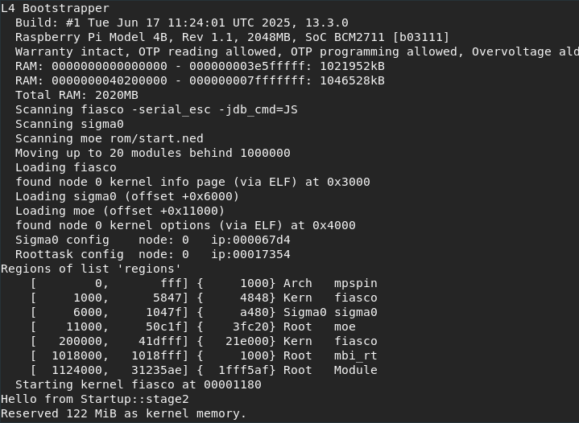
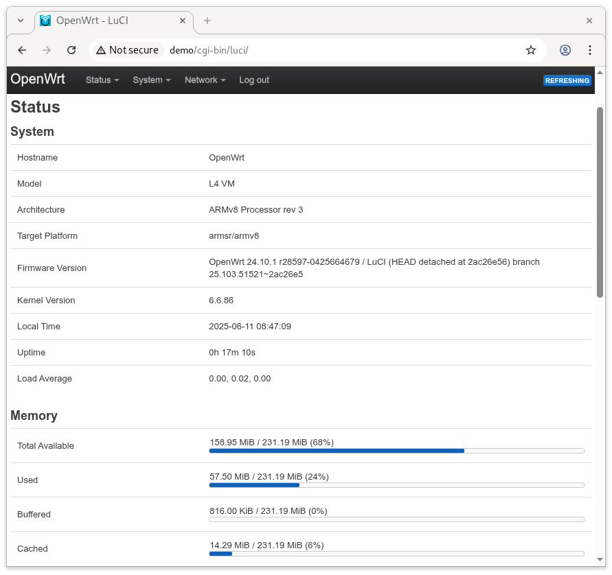

L4Re on Raspberry Pi
********************

This is a demo of some capabilities of open source L4Re Operating System Framework running on the
Raspberry Pi 4B. It demonstrates L4Re's virtualization capabilities as well as running native L4Re
MicroApps.

This demo features two virtual machines (VMs). The first VM runs OpenWRT and acts as an on-device
firewall. The second VM runs Raspian Lite and connects through OpenWRT to the internet. A native
L4Re MicroApp periodically blinks the green activity LED of the Raspberry Pi. The persistent
storage for the VMs is provided by a native eMMC driver which securely provides individual
partitions to each VM.

Getting Started
===============

#. Download the current `demo image <https://l4re.org/download/demo/rpi4_l4re_demo-202506.img.gz>`_
   (`SHA256 checksum <https://l4re.org/download/demo/rpi4_l4re_demo-202506.img.gz.SHA256SUM>`_)
   for the SD card.
#. Flash the image to a SD card (size >= 8GB)

   .. sourcecode:: shell
      :caption: Linux

       $ zcat rpi4_l4re_demo-202506.img.gz | dd of=/dev/<SD_card_dev_node> bs=10M status=progress

   .. sourcecode:: shell
      :caption: Mac

       $ zcat < rpi4_l4re_demo-202506.img.gz | dd of=/dev/rdisk<X> bs=10M status=progress

#. Once the flashing has finished put the SD card into your Raspberry Pi 4.
#. Connect a USB2Serial adapter to your Raspberry Pi 4 and then to your computer.
#. Connect Ethernet cable to your Raspberry Pi (make sure you have a DHCP server running in your
   network, your usual home router should do it).
#. Connect terminal program e.g. `minicom`:

   .. sourcecode:: shell

       $ minicom -D /dev/serial/by-id/<serial_adapter> -b 115200

#. Connect the power adapter and let the Raspberry Pi boot
#. You will see the boot messages in your terminal program

   Screenshot of L4Re boot messages

**Troubleshooting**

- Make sure hardware flow-control is **disabled**.

- If ``dd`` fails due to permission problems, ensure your current user is in
  the `plugdev` group, or use ``sudo`` or run as root.

- If minicom returns with permission problems, make sure your current user is in the `dialout` group:

.. sourcecode:: shell

    $ sudo usermod -a -G dialout <your user>

Welcome to L4Re
===============

Once L4Re has booted you will be greeted by the L4Re console `cons`. It allows you to connect to
different client consoles.

.. sourcecode::

    demo> help   # list available commands
    demo> ls     # list connected clients
              emmc     [        ] out:   84/  4900 in:    0/    0
       ex_gpio_led     [    demo] out:    1/    28 in:    0/    0
                io     [        ] out:  228/ 11373 in:    0/    0
              mbox     [        ] out:    1/    67 in:    0/    0
               net     [        ] out:   27/  1911 in:    0/    0
        vm_openwrt (1) [        ] out:  328/ 19499 in:    0/    0
        vm_raspian (2) [        ] out:  516/ 37126 in:    0/    0

You can see 2 virtuals machines (VMs) running: `vm_openwrt` and `vm_raspian`.

Connect to the VM consoles

.. sourcecode::

    demo> connect vm_openwrt

To discconnect from a client console press `CTRL+e .` ("Ctrl e" plus "dot")

The VMs
=======

OpenWRT
-------

If your PC and the Rasperry Pi are connected to the same network you can access the OpenWRT web
interface.

   Screenshot of OpenWrt web interface

Find out the IP address of the OpenWRT VM:

.. sourcecode::

    demo> connect vm_openwrt
    $ ip a

In your browser navigate to `http://<ip_address_of_openwrt>` and just login as the `root` user, no password is set.

Raspian Lite
------------

Login to Raspian:

.. sourcecode::

    demo> connect vm_raspian

.. note::

    | login: `pi`
    | password: `raspberry`

If the Raspberry Pi is connected to a network via Ethernet you can connect to the internet. OpenWRT
is NAT'ing the network access.

.. sourcecode::

    pi:~ $ ping www.l4re.org
    pi:~ $ sudo apt update

Native MicroApps
================

eMMC driver
-----------

See output from eMMC driver:

.. sourcecode::

    demo> cat emmc

ex_gpio_led
-----------

This MicroApp makes the Raspberry Pi's activity LED blink.
