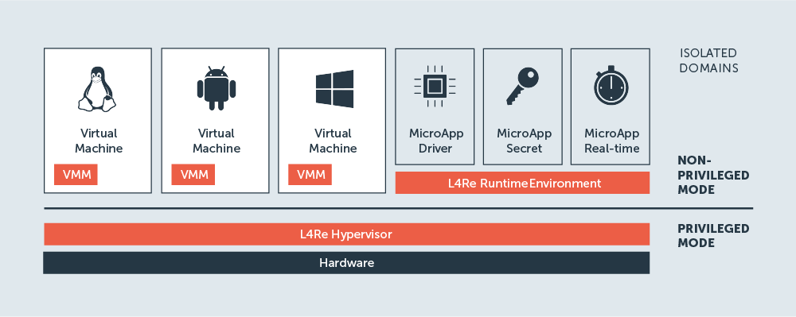

Architecture Overview
*********************

.. todo::

   - People need to understand that L4Re is an Operating System

The intention of this section is to provide a short overview about the L4Re
Operating System Framework. For a more in-depth introduction, see
:doc:`/detailed_introduction/architecture_concepts/index`.

Architecturally, L4Re ist a `microkernel
<https://en.wikipedia.org/wiki/Microkernel>`_ based operating system. That is,
the amount of code that is running in the most privileged level in the system
is kept reasonably small. This design is key to building a secure and reliable
system from ground up.

L4Re System Structure
=====================

The L4Re Operating System has a multi-tier architecture consisting of the
following layers:

.. todo::

   - same image polishing as on :doc:`index`

   L4Re's system architecture

.. topic:: Microkernel

   The L4Re Microkernel is the component at the lowest level of the software
   stack. It is the only piece of software of the L4Re operating system that
   runs in a higher privilege level of the processor to be able to program
   to processor's isolation features.

   The kernel provides primitives to execute programs in tasks, to enforce
   isolation among them, and to provide means of secure communication in order
   to let them cooperate. As the kernel is the most privileged,
   security-critical software component in the system, it is a general design
   goal to make it as small as possible in order to reduce its attack surface.
   It provides only a minimal set of mechanisms that are necessary to support
   applications.

.. topic:: Runtime Environment

   The small kernel offers a concise set of interfaces, but these are not
   necessarily suited for building applications directly on top of it. The L4Re
   Runtime Environment aims at providing more convenient abstractions for
   application development. It comprises low-level software components that
   interface directly with the microkernel. The root pager sigma0 and the root
   task Moe are the most basic components of the L4Re Runtime Environment.
   Other services (e.g., for device enumeration) use interfaces provided by
   them.

.. topic:: Applications

   Applications run on top of the system and use services provided by the
   runtime environment – or by other applications. There may be several types
   of applications in the system and even virtual machine monitors and device
   drivers are considered applications in L4Re. They are running alongside
   other applications on the system.

   Lending terminology from the distributed systems area, applications offering
   services to other applications are usually called **servers**, whereas
   applications using those services are named **clients**. Being in both roles
   is also common, for instance, a file system server may be viewed as a server
   with respect to clients using the file system, while the server itself may
   also act as a client of a hard disk driver.

.. topic:: Virtual Machines

   Virtual machines (VMs) provide a virtual environment to run a whole
   operating system with its applications. VMs are run by a hypervisor,
   similar that applications are run by an operating system.

   L4Re is both an operating system and a hypervisor, i.e., it can run
   L4Re applications side-by-side with VMs. In L4Re, a virtual machine
   monitor program (VMM) provides the virtual environment for a guest
   operationg system.

   Device virtualization is primarily implemented through Virtio, the
   defacto standard for virtual devices and commonly available in many
   operating systems already.

Next Steps
==========
- :doc:`Get started </getting_started/index>` using L4Re
- Read the :doc:`/detailed_introduction/index`
